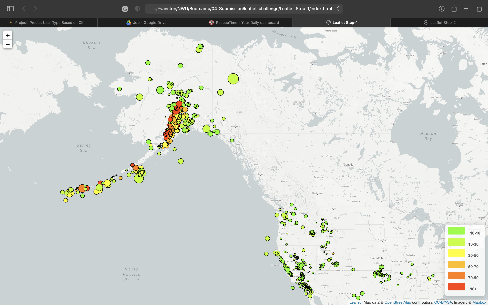

# Location and Magnitude of Earthquakes in the Past 7 Days

## Project Description

The goal of the project is to display multiple and interactive maps with the location and magnitude of earthquakes during the last 7 days around the world. The `Javascript-Leaflet` library, `HTML`, `CSS`, `Bootstrap`, and `Javascript` were used in the project. The Mapbox-API was also used to load the base maps. The project was divided into two steps with different levels of complexity.

- **Step 1:**
A single base layer and one set of data were used:
  - **Base layer:** [mapbox.grayscale](https://docs.mapbox.com/api/maps/#raster-tiles)
  - **Data layer Source and Data:**
    - **Source:** [United States Geological Survey (USGS)](https://earthquake.usgs.gov/earthquakes/feed/v1.0/geojson.php)
    - **Data:** [Earthquakes - Last 7 days - All Earthquakes](https://earthquake.usgs.gov/earthquakes/feed/v1.0/summary/all_week.geojson)

- **Step 2:**
Multiple optional and interactive base layers were included. An additional dataset and plot were included and they can be activated and deactivated by the user.
  - **Base layer:**
    - [mapbox.grayscale](https://docs.mapbox.com/api/maps/#raster-tiles)
    - [mapbox.satellite](https://docs.mapbox.com/api/maps/#raster-tiles)
    - [mapbox.outdoors](https://docs.mapbox.com/api/maps/#raster-tiles)
  - **Data layer Source and Data:**
    - **Layer 1** Earthquake information
      - **Source:** [United States Geological Survey (USGS)](https://earthquake.usgs.gov/earthquakes/feed/v1.0/geojson.php)
      - **Data:** [Earthquakes - Last 7 days - All Earthquakes](https://earthquake.usgs.gov/earthquakes/feed/v1.0/summary/all_week.geojson)
    - **Layer 2:** Tectonic Plates
      - **Source:** [Hugo Ahlenius, GIS-and-Cartography Consultant](https://github.com/fraxen/tectonicplates)
      - **Data:** [Tectonic Plates Boundaries](https://raw.githubusercontent.com/fraxen/tectonicplates/master/GeoJSON/PB2002_boundaries.json)

## Libraries Required (already included in the index.html file)

- D3 JavaScript
- Leaflet

### Sample app Screenshot

- **Step 1:**

- **Step 2:**

## Instructions

### Steps

1. Download or clone all the files contained in this repo.
2. Create your  [Mapbox API Key](https://account.mapbox.com/auth/signup/).
3. Include `API-KEY`  in the `/Leaflet-Step-1/static/js/config.js` and `/Leaflet-Step-2/static/js/config.js` files.
4. Load the `Leaflet-Step-1/index.html` and `Leaflet-Step-2/index.html` files.

## File Description

### Leaflet-Step-1

- Contains all the files for the first part of the project.

#### index.html

- Contains the HTML code that drives the maps and references the required libraries

#### static

- Contains the `css` file with the formatting information
- Contains the `js` with the `Javascript` code using the D3 library for the interactive plots.

#### images

- Ccontains the `gif` and `png` files with screenshots of the app running

### Leaflet-Step-2

- Contains all the files for the second part of the project.
- All folders are the same.

